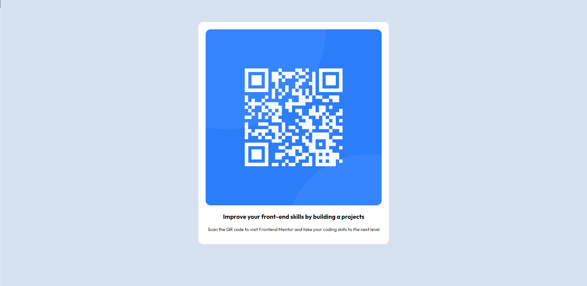

# qr-code-component
A simple QR Code Component with HTML and CSS

# Frontend Mentor - QR code component solution

This is a solution to the [QR code component challenge on Frontend Mentor](https://www.frontendmentor.io/challenges/qr-code-component-iux_sIO_H). Frontend Mentor challenges help you improve your coding skills by building realistic projects. 

## Table of contents
- [Link to the solution](#Link-to-the-solution)
- [Screenshot](#screenshot)
- [My process](#my-process)
  - [Built with](#built-with)
  - [What I learned](#what-i-learned)
  - [Continued development](#continued-development)
- [Author](#author)

### Link to the solution
HTML: (https://github.com/RikoDevs/QR-Code-Component/blob/main/HTML.html)
CSS: (https://github.com/RikoDevs/QR-Code-Component/blob/main/CSS%20Solution.css)

### Screenshots

## My process

I started looking at the design preview that i downloaded from Frontend Mentor, then i followed the style-guide file to make sure that my code was in order. 

After making sure about few things, then i started to write my code in HTML first, then after i finished writing it in HTML, i started to apply some designs with CSS.

### Built with

- HTML5 
- CSS (Flexbox, margin, padding, etc.)

### What I learned

I learned few brand new things that i haven't learned before, such as: 

- Using semantics can be useful.

### Continued development

I'll learn more about flexbox concepts, margin, padding, and i'll try to use more "nav", "span", "div" in the future so that my codes look elegant.

## Author

- Instagram: @rikozz._ (https://www.instagram.com/rikozz._/)
